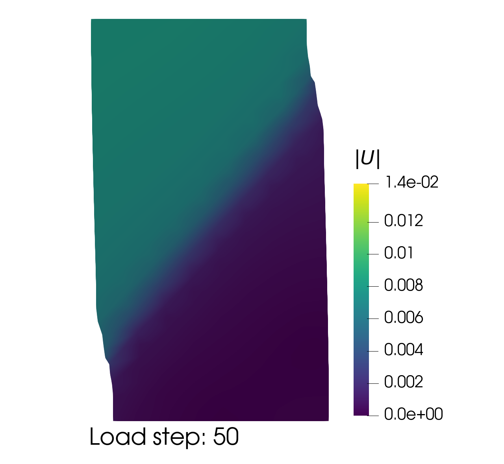
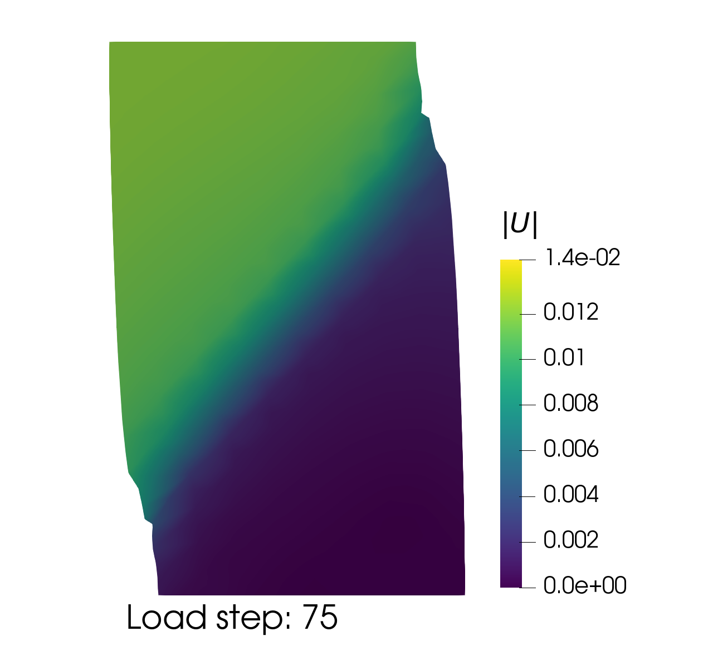
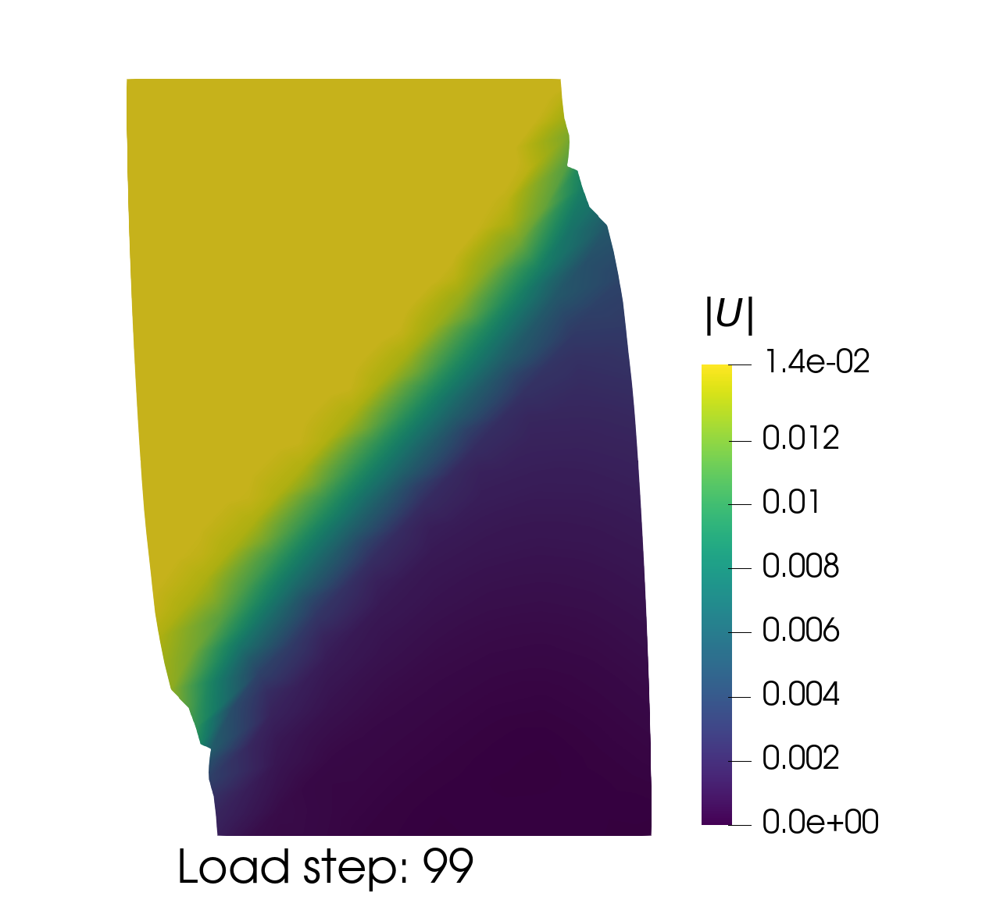
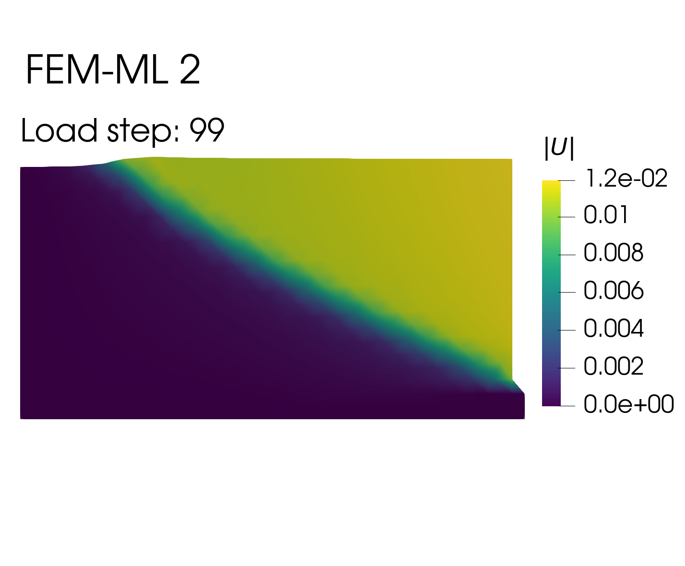

# FEM-ML-DEM
- Author: shguanWHU
- phone: +86-13016427343
- Other contributors will be warmly welcomed.
- This framework is based on the [FEM](https://launchpad.net/escript-finley)/[DEM](https://yade-dem.org/doc/) coupling platform proposed by [Prof. Guo](https://person.zju.edu.cn/nguo). 
- This is a framework of the **data-driven multiscale** mechanical computation platform of the **granular materials**.
- I sorted the files and deleted the unnecessary file.

## Explicit mode implemented
- Reason: the tangent operator is necessary in the Newton iteration. While the tangent operator is not easily accessable especially in the ML model since the tangent operator can not be derived through the differentiation due to the stress-strain fluctuation.
- Up to now, the explicit mode is under debug and testing.

## Simulation

| Biaxil simulation                                                                                                                                         | Retaining wall simumation                                                                                                      |
|-----------------------------------------------------------------------------------------------------------------------------------------------------------|--------------------------------------------------------------------------------------------------------------------------------|
|  |  |
|  |  |
|  |  |

# 
